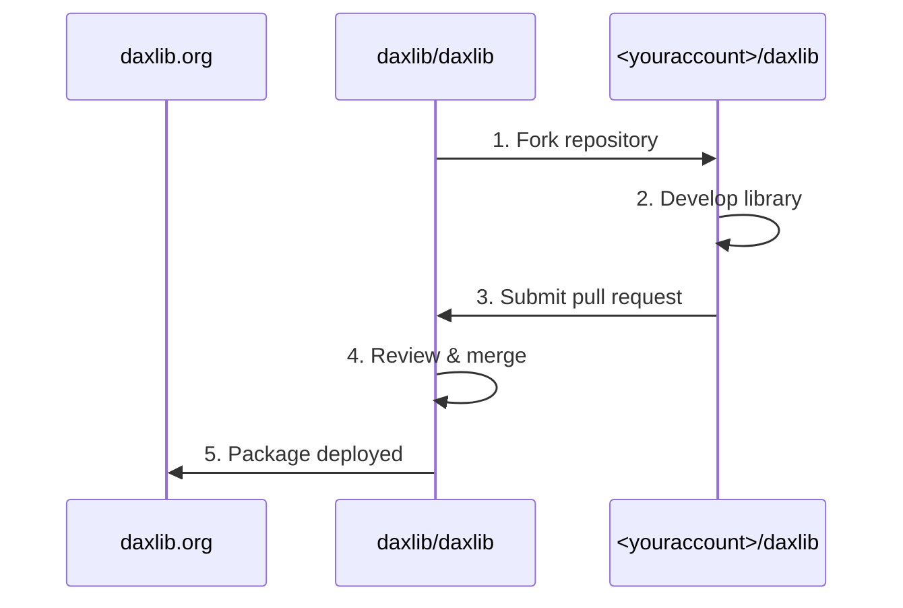
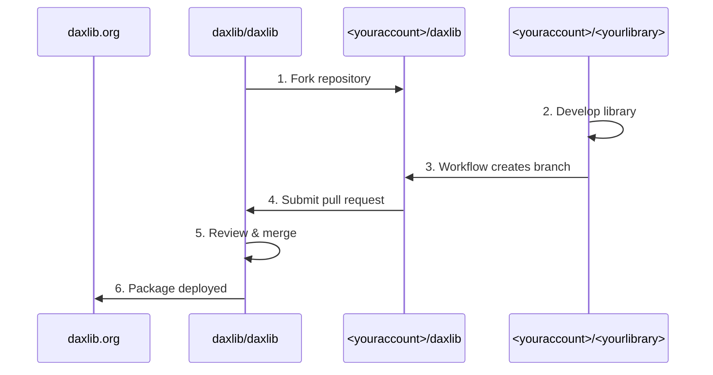

A DAX library is a collection of DAX user-defined functions (UDFs) written in TMDL format. This is accompanied with `manifest.daxlib`, which include metadata, such as the library name, version, and author. The library can also include a `README.md` and/or `icon.png`, but these are optional.

Users can contribute a library via a pull request (PR) to `daxlib/daxlib`. Once approved, the library is published on daxlib.org, making it available for browsing, installation, and use.

Depending on your DAX library's size and complexity, you can choose one of the following methods to contribute it to DAX Lib:

## Small Library

In this mode you develop your library on a personal fork of `daxlib/daxlib` (`<youraccount>/daxlib`), then submit a PR to `daxlib/daxlib` to submit your library, and your library will be released on daxlib.org. 

For in-depth steps follow the [Contribute Small Libraries to DAX Lib](fork-daxlib.md) guide.

### Small Library Workflow



### Small Library Structure

`daxlib/daxlib` has the structure below. You can add your library under `packages/<firstletterofyouraccountname>`.

```txt
└── 📁 packages
    |── 📁 a   
    ├── 📁 ...
    ├── 📁 y
    │    └── 📁 your.library
    │         ├── 📁 0.1.0
    │         └── 📁 0.1.1
    │              ├── 📁 lib
    │              │    └── functions.tmdl   // Required - Your DAX UDF functions 
    │              ├── 📄 icon.png           // Optional - Icon for your library
    │              ├── 📄 README.md          // Optional - Docs for your library
    │              └── 📄 manifest.daxlib    // Required - Declares package properties
    ├── 📁 ...
    └── 📁 z
```

## Medium/Large Library

The process for Medium/Large libraries uses a extended workflow.

We still need a fork of `daxlib/daxlib` (`<youraccount>/daxlib`), and will still submit a pull request to `daxlib/daxlib` to publish a library.

The difference is that development of the library will occur on a fork of `daxlib/lib-quickstart-template` (`<youraccount>/<yourlibrary>`). A github workflow can be run on `<youraccount>/<yourlibrary>`, which will push the library to a new, version specific, branch of `<youraccount>/daxlib`, which can then be submitted via a pull request to `daxlib/daxlib`.

For in-depth steps follow the [Contribute Medium-Large Libraries to DAX Lib](github-repo.md) guide.

### Medium/Large Library Workflow



### Medium/Large Library Structure

`daxlib/lib-quickstart-template` has the following structure. The the structure is slightly different from the Small library, but the required content remain the same, except your library now lives in the `src` folder.

```txt
├── 📁 .github
│    └── 📁 workflows
│         └── 📄 publish-package.yml   // Workflow to create branch on `<youraccount>/daxlib` with your library version
└── 📁 src
        ├── 📁 lib
        │    └── functions.tmdl         // Required - Your DAX UDF functions
        ├── 📄 icon.png                 // Optional - Icon for your library
        ├── 📄 README.md                // Optional - Docs for your library
        └── 📄 manifest.daxlib          // Required - Declares package properties
```

### Why Create a Medium/large Library?

Since you have a specific repo dedicated to your library you are able to:

- Connect with your users with GitHub issues
- Collaborate with others to develop the library
- Add documentation site and host (for example) on GitHub Pages

## DAX Lib official libraries

For in-depth steps follow the [Contribute to DAX Lib official libraries](daxlib-libraries.md) guide.
